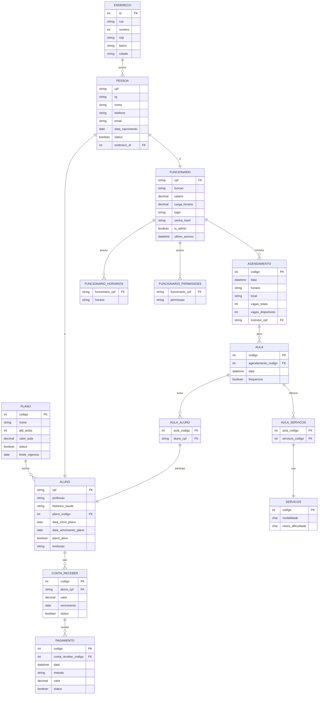

# Tarefa 01

Este documento contém os links para os scripts utilizados na tarefa 01, sendo eles de criação e povoamento.

---

## 🗃️ Scripts do Esquema

- [Criação do esquema](create_script.sql)
- [Povoamento do esquema](inserts_script.sql)

---
## Modelo de dados

