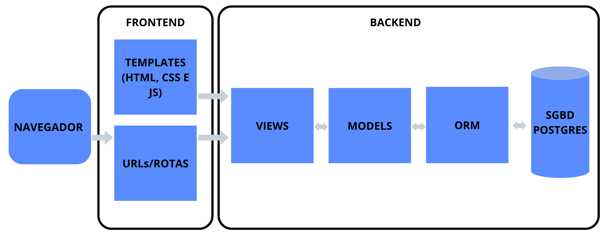
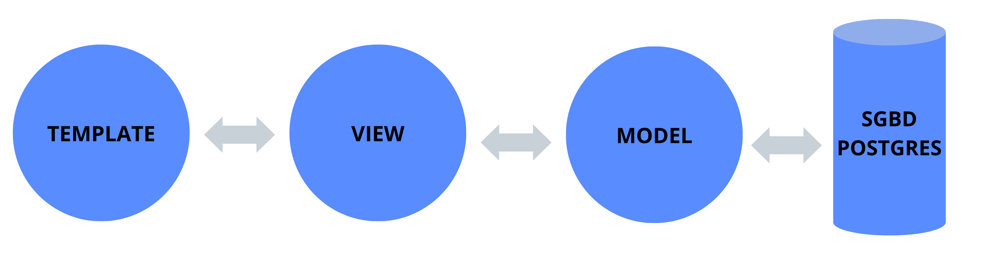

# Projeto Arquitetural do Software – Versão Django

*Adaptado do Modelo BSI - Doc 005 - Documento de Projeto Arquitetural do Software*

---

## 1. Descrição da Arquitetura do Projeto

O projeto será estruturado segundo o modelo **cliente-servidor**, com uma **arquitetura monolítica**, dividida em camadas lógicas conforme o padrão MVC adaptado usado pelo Django.

O backend será implementado utilizando com o framework **Django**.

---

## 2. Visão Geral da Arquitetura

A arquitetura geral proposta para o projeto com Django segue os seguintes componentes:

- **Camada de Apresentação (Templates):** Responsável pelos arquivos HTML, CSS e JavaScript, usados na renderização das páginas.
- **Camada de Controle (Views/Serializers):** Implementa a lógica de controle da aplicação, coordenando o fluxo entre dados e apresentação. Também contém os endpoints REST no caso de APIs.
- **Camada de Modelo:** Define os modelos de dados usando o ORM do Django, mapeando as entidades para o banco relacional.
- **Banco de Dados:** PostgreSQL será utilizado como sistema gerenciador de banco de dados relacional.
- **Camada de Integração Externa:** Comunicação com APIs e serviços externos por meio de requisições HTTP autenticadas.

### Sobre o padrão MTV do Django

Diferente de outras frameworks que adotam o padrão **MVC (Model-View-Controller)**, o Django organiza sua arquitetura segundo o padrão **MTV (Model-Template-View)**, que está melhor representada a seguir:

| Componente MTV      | Responsabilidade                                                                 |
|---------------------|----------------------------------------------------------------------------------|
| **Model**           | Representa os dados da aplicação, usando o ORM do Django.                        |
| **Template**        | Responsável pela camada de apresentação (HTML/JS/CSS).                           |
| **View**            | Atua como "Controller", recebendo requisições, processando dados e retornando respostas. |

Assim, no Django, o termo "View" refere-se à lógica de controle — o que, em outras arquiteturas, seria considerado o Controller.

---

### Comunicação no padrão MTV

A comunicação no padrão **MTV** ocorre da seguinte forma:

- A **View** se comunica com o **Model** e com o **Template**.
- O **Model** só se comunica com a **View**.
- O **Template** apenas recebe dados da **View**, sem qualquer interação direta com o **Model**.

Dessa forma, a estrutura favorece a **organização**, **reutilização de código** e **manutenção** da aplicação ao longo do tempo.

---

## 3. Requisitos Não-Funcionais

O Django, por ser um framework completo e opinativo, já entrega várias garantias de requisitos não-funcionais desde sua criação padrão de projeto. Abaixo estão os requisitos mapeados com o que o Django já oferece nativamente ou com mínimo esforço adicional:

| Requisito              | Detalhes como o Django irá atender                                                                                                                            |
|------------------------|--------------------------------------------------------------------------------------------------------------------------------------------------|
| **Desempenho**         | - Django possui sistema de cache embutido e ORM otimizado para operações comuns.  - O uso de paginação com `PageNumberPagination` do DRF facilita respostas rápidas em listas grandes. |
| **Interoperabilidade** | - Autenticação via Token ou JWT é suportada com pacotes como `simplejwt`. |
| **Portabilidade**      | - O projeto Django roda em qualquer sistema com Python instalado.  |
| **Segurança**          | - O Django já vem com proteções contra CSRF, XSS e SQL Injection ativadas por padrão.  - Suporte fácil à comunicação via HTTPS quando configurado em produção. |
| **Manutenibilidade**   | - Estrutura padrão em apps modulares.  - Separação clara de responsabilidades (models, views, templates, forms, etc.).  - Admin automático facilita testes e validação dos dados. |

---

## 4. Mecanismos Arquiteturais

| Mecanismo de Análise | Mecanismo de Design         | Mecanismo de Implementação                       |
|----------------------|-----------------------------|--------------------------------------------------|
| Persistência         | Banco de dados relacional   | PostgreSQL                                   |
| Camada de Dados      | Mapeamento Objeto-Relacional| Django ORM                                       |
| Frontend             | Interface com o usuário     | Django Templates, HTML5, JavaScript, Bootstrap 5 |
| Backend              | Django                 | Django Framework                            |

---