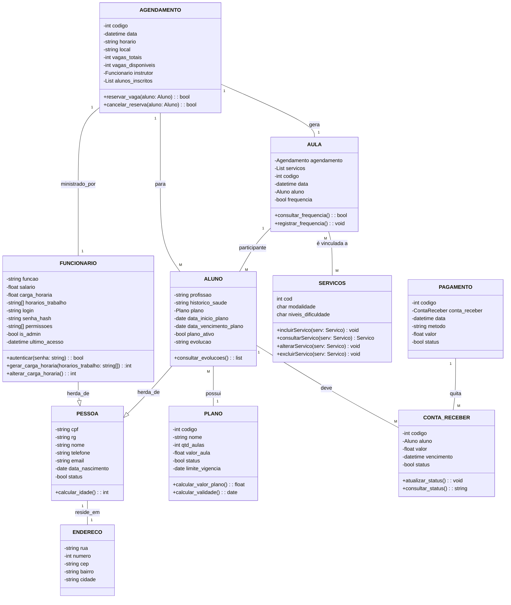

# Documento de Modelos

## Modelo de Dados

## Dicionário de Dados

### Tabela: ENDEREÇO
**Descrição:** Armazena as informações de um endereço cadastrado no sistema.  
**Observação:** Refere-se a um local específico dentro de uma cidade, detalhado por informações como rua, número e CEP.

| Nome | Descrição | Tamanho | Restrições de Domínio |
|------|-----------|---------|------------------------|
| rua | nome da rua onde o endereço está localizado | 50 | Not Null |
| numero | número do imóvel no endereço | — | — |
| cep | código postal do endereço | 10 | Not Null |
| bairro | referência ao bairro associado ao endereço | 30 | Not Null |
| cidade | referência à cidade associada ao endereço | 30 | Not Null |

---

### Tabela: PESSOA
**Descrição:** Armazena as informações de uma pessoa cadastrada no sistema.  
**Observação:** Refere-se a dados essenciais de uma pessoa, como documentos, contato e estado de atividade.

| Nome | Descrição | Tamanho | Restrições de Domínio |
|------|-----------|---------|------------------------|
| cpf | dado do Cadastro de Pessoa Física da pessoa | 14 | PK/Unique |
| rg | dado do Registro Geral da pessoa | 15 | — |
| nome | nome completo da pessoa | 125 | Not Null |
| telefone | número de telefone da pessoa | 15 | — |
| email | endereço de e-mail da pessoa | 30 | — |
| data_nascimento | data de nascimento da pessoa | — | Not Null |
| status | status de atividade da pessoa | — | Not Null |

---

### Tabela: ALUNO
**Descrição:** Armazena as informações de um aluno cadastrado no sistema.  
**Observação:** Refere-se aos alunos matriculados.

| Nome | Descrição | Tamanho | Restrições de Domínio |
|------|-----------|---------|------------------------|
| profissao | ocupação do aluno | 30 | — |
| historico_saude | informações sobre o histórico de saúde do aluno | 1000 | — |
| plano | plano de serviços do aluno | — | FK |
| data_inicio_plano | data de começo de atividades do plano do aluno | — | Not Null |
| data_vencimento_plano | data do final de atividades do plano do aluno | — | Not Null |
| plano_ativo | status de indicação do plano em ativo ou inativo | — | Not Null |
| evolução | registro de evolução do aluno | 1000 | Not Null |
Markdown Preview Mermaid Support
---

### Tabela: PLANO
**Descrição:** Armazena as informações do plano de um aluno cadastrado no sistema.  
**Observação:** Refere às informações de direitos e custos do plano de atividades do aluno.

| Nome | Descrição | Tamanho | Restrições de Domínio |
|------|-----------|---------|------------------------|
| codigo | id referente a um plano de atividades do aluno | — | Not Null |
| nome | nome do plano baseado na quantidade de dias | STRING | Not Null |
| qtd_aulas | quantidades de aulas que o aluno tem direito no plano | — | Not Null |
| valor_aula | o valor a ser pago por cada aula ofertada no estabelecimento | — | Not Null |

---

### Tabela: FUNCIONÁRIO
**Descrição:** Armazena as informações de um funcionário cadastrado no sistema.  
**Observação:** Refere-se aos funcionários que desempenham atividades na organização.

| Nome | Descrição | Tamanho | Restrições de Domínio |
|------|-----------|---------|------------------------|
| funcionario_cpf | dado do Cadastro da Pessoa Física do funcionário | 14 | PK/FK/Unique |
| funcao | cargo ou função desempenhada pelo funcionário | 25 | Not Null |
| salario | valor do salário do funcionário | — | Not Null |
| carga_horaria | carga horária semanal do funcionário | — | Not Null |
| horarios_trabalho | horários da escala de trabalho do funcionário | — | Not Null |
| login | nome de usuário utilizado para acessar o sistema | 30 | Not Null |
| senha_hash | senha utilizada para acessar o sistema | 10 | Not Null |
| permissoes | conjunto de ações que se pode acessar no sistema | — | Not Null |
| is_admin | status de indicação do usuário em ser ou não admin | — | Not Null |
| ultimo_acesso | data de último acesso no sistema pelo usuário | — | Not Null |

---

### Tabela: AGENDAMENTO
**Descrição:** Armazena as informações dos horários oferecidos a partir da disponibilidade.  
**Observação:** Refere-se aos horários disponíveis, selecionando quem será o instrutor para as reservas do aluno.

| Nome | Descrição | Tamanho | Restrições de Domínio |
|------|-----------|---------|------------------------|
| codigo | identificador de agendamentos gerado pelo SGBD | — | PK/Unique |
| data | a data referente ao dia da aula | — | Not Null |
| horario | o horário referente ao momento da aula | — | Not Null |
| local | sala no studio onde será a aula no determinado horário | 50 | — |
| vagas_totais | lista de todos os horários de cada aula | — | Not Null |
| vagas_disponiveis | lista de horários com disponibilidade para mais alunos | — | Not Null |
| instrutor | dados resgatados do instrutor | — | FK/Not Null |
| alunos_inscritos | lista de alunos que estão selecionados para a aula | — | FK/Not Null |

---

### Tabela: SERVIÇOS
**Descrição:** Armazena as informações dos serviços oferecidos pela organização cadastrados no sistema.  
**Observação:** Refere-se aos serviços disponíveis, podendo englobar diferentes tipos de modalidades.

| Nome | Descrição | Tamanho | Restrições de Domínio |
|------|-----------|---------|------------------------|
| codigo | identificador de serviços gerado pelo SGBD | — | PK |
| modalidade | tipos de aulas oferecidos na organização | 50 | Not Null |
| niveis_dificuldade | os diferentes graus de complexidade de um serviço | 30 | Not Null |

---

### Tabela: AULA
**Descrição:** Armazena as informações das aulas e o status de frequência dos alunos.  
**Observação:** Refere às aulas com as datas de cada uma, os alunos e a frequência.

| Nome | Descrição | Tamanho | Restrições de Domínio |
|------|-----------|---------|------------------------|
| agendamento | o agendamento que foi feito para a aula | — | FK |
| serviços | conjunto de serviços prestados na aula | — | FK |
| codigo | identificador de aulas gerado pelo SGBD | — | PK/Unique |
| data | a data de uma aula | — | Not Null |
| aluno | registrar os alunos que estão agendados para a aula | — | FK |
| frequencia | indicador de presença de cada aluno para cada aula | — | — |

---

### Tabela: CONTA_RECEBER
**Descrição:** Armazena as informações das aulas e o status de frequência dos alunos.  
**Observação:** Refere às aulas com as datas de cada uma, os alunos e a frequência.

| Nome | Descrição | Tamanho | Restrições de Domínio |
|------|-----------|---------|------------------------|
| codigo | identificador de contas a receber gerado pelo SGBD | — | PK/Unique |
| aluno | identificador referente ao aluno | — | FK |
| valor | valor de conta mensal a partir da quantidade de aulas | — | Not Null |
| vencimento | data de vencimento para realizar o pagamento | — | Not Null |
| status | indicador se o pagamento foi realizado ou não | — | Not Null |

---

### Tabela: PAGAMENTO
**Descrição:** Armazena as informações dos pagamentos realizados pelos alunos.  
**Observação:** Contém informações como a data e o método de pagamento.

| Nome | Descrição | Tamanho | Restrições de Domínio |
|------|-----------|---------|------------------------|
| codigo | identificador de pagamento gerado pelo SGBD | — | PK/Unique |
| conta_receber | identificador referente a conta a receber | — | FK |
| data | data em que foi realizado o pagamento | — | Not Null |
| metodo | referente ao meio usado para realizar o pagamento | 20 | Not Null |
| valor | valor com possibilidade de desconto do pagamento | — | Not Null |
| status | indicador de efetivação do pagamento | — | — |
