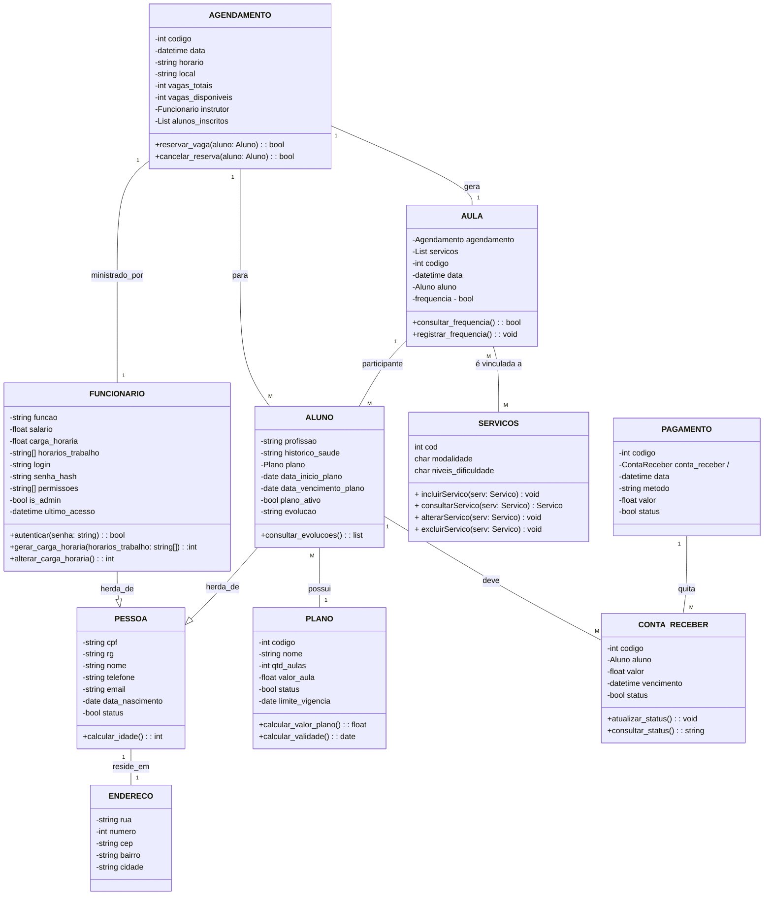

# Documento de Visão

Documento construído a partir do **Modelo BSI - Doc 001 - Documento de Visão** que pode ser encontrado no
link: https://docs.google.com/document/d/1DPBcyGHgflmz5RDsZQ2X8KVBPoEF5PdAz9BBNFyLa6A/edit?usp=sharing

## Histórico de revisões

| Data       | Versão  | Descrição                          | Autor                          |
| :--------- | :-----: | :--------------------------------: | :----------------------------- |
| 07/04/2025 | 0.0.1   | Documento inicial | Todos |

## Descrição do Projeto

O Sistema de Gestão para “Studio de Pilates MS” é projetado para abranger uma
variedade de funções essenciais para o funcionamento eficaz de um pequeno estúdio de
Pilates. Este sistema inclui o controle de atividades, gerenciamento de clientes, agendamento de aulas, registro de pagamentos e acompanhamento do progresso dos alunos.
O propósito principal do sistema é desenvolver um software que simplifique e automatize
as operações diárias do estúdio. Ele permite o registro detalhado de informações sobre o
funcionamento geral. Além disso, o sistema auxilia na organização da agenda, oferecendo um calendário interativo para agendamento conveniente.
Com o sistema, é possível um melhor controle e gerenciamento eficaz das atividades
gerais da empresa, facilitando e agilizando todos os processos para a equipe e para os
clientes. Este software é uma ferramenta valiosa para a administração do estúdio,
contribuindo para a eficiência operacional e o sucesso do negócio.

## Equipe e Definição de Papéis

Membro     |     Papel   |   E-mail   |
---------  | ----------- | ---------- |
Taciano    | Cliente Professor  | taciano@bsi.ufrn.br
Mayara     | Cliente            | 
Aron       | Analista           | aronsilvagm@gmail.com
Beatriz    | Analista           | beatriz.costa.151@ufrn.edu.br
Eloisa     | Analista           | maria-eloisa-santos@outlook.com
Giovanna   | Analista           | giovanna.melo.710@ufrn.edu.br
Mariana    | Líder técnico      | mari_caico@yahoo.com.br
Virlânia   | Analista           | virlaniacanuto190@gmail.com

### Matriz de Competências

Membro     |     Competências   |
---------  | ----------- |
Aron       | Experiência em Python, C e Flutter | 
Beatriz    | Experiência em C, Java, Flutter, PHP,  Python, Django |
Eloisa     |  | Experiência em C, Flutter, Laravel, PHP,  Python, Django |
Giovanna   | Experiência em C, Flutter e Python |
Mariana    | Experiência em Java Script, C, Flutter e Python |
Virlânia   |Experiência em Java, C, Flutter, Python, Django  |

## Perfis dos Usuários

O sistema poderá ser utilizado por diversos usuários. Temos os seguintes perfis/atores:

Perfil                                 | Descrição   |
---------                              | ----------- |
Administrador | Este usuário realiza os cadastros base, autoriza a entrada de novos funcionários ao sistema, além de poder realizar todas as funcionalidades do sistema.
Funcionário | Este ator representa as pessoas físicas que atendem no espaço. Os funcionários poderão fazer cadastro de clientes, cadastrar turmas, preencher o formulário de evolução do aluno e acompanhar seu rendimento mensal.

## Lista de Requisitos Funcionais

### Entidade Aluno - US01 - Manter Aluno

Aluno possui CPF, RG, nome, telefone, e-mail, data de nascimento, status (ativo ou inativo), endereço, profissão, histórico de saúde, plano associado, datas de início e vencimento do plano, status do plano e evolução registrada ao longo do tempo.

| Requisito | Descrição | Ator |
|-----------|-----------|------|
| **RF01.01 - Cadastrar Aluno** | Permite cadastrar um novo aluno com dados pessoais, endereço, profissão e histórico de saúde. O status inicial do aluno é definido automaticamente como "Ativo". | Funcionário |
| **RF01.02 - Consultar Aluno** | Permite buscar alunos por nome, CPF, status (ativo/inativo) ou situação do plano. A consulta retorna todos os dados do aluno, incluindo informações pessoais, endereço, profissão, histórico de saúde, plano associado, vigência do plano e status. | Funcionário |
| **RF01.03 - Alterar Aluno** | Permite atualizar nome, RG, telefone, e-mail, data de nascimento, endereço, profissão e histórico de saúde do aluno. | Funcionário|
| **RF01.04 - Ativar/ Desativar Aluno** | Permite marcar o aluno como "Inativo", mantendo todo o histórico ou reativar um aluno que estava inativo. Alunos inativos não aparecem nas buscas padrão. | Funcionário |
| **RF01.05 - Associar/Alterar Plano do Aluno** | Permite associar ou alterar o plano do aluno, definindo datas de início e vencimento, além do status do plano. Essa ação gera automaticamente as contas a receber. | Funcionário |
| **RF01.06 - Desativar Plano do Aluno** | Permite desativar o plano do aluno sem interferir no status geral do aluno. | Funcionário |
| **RF01.07 - Consultar Status do Plano do Aluno** | Permite verificar se o plano do aluno está ativo ou inativo, além das datas de validade. | Funcionário |
| **RF01.08 - Registrar Evolução do Aluno** | Permite que o instrutor registre observações sobre o progresso do aluno. | Funcionário |
| **RF01.09 - Consultar Histórico de Evolução do Aluno** | Permite visualizar todas as anotações feitas sobre a evolução do aluno. | Funcionário |
| **RF01.10 - Consultar/Alterar Histórico de Saúde** | Permite consultar e alterar o histórico de saúde do aluno. | Funcionário |

### Entidade Funcionário - US02 - Manter Funcionário
Funcionário tem CPF, RG, nome, telefone, email, endereço, data de nascimento, status, função, salário, carga horária, horários de trabalho, login, senha, permissões, status de administrador e registro de último acesso.

| Requisito | Descrição | Ator |
|-----------|-----------|------|
| **RF02.01 - Cadastrar Funcionário** | Permite cadastrar um novo funcionário informando: CPF, RG, nome, telefone, email, endereço, data de nascimento, função, salário, carga horária e horários de trabalho. O sistema gera automaticamente login, senha inicial e define permissões básicas. | Administrador |
| **RF02.02 - Consultar Funcionário** | Permite buscar funcionários por: nome, CPF, função ou status. Os resultados exibem todos os atributos cadastrais. | Administrador |
| **RF02.03 - Alterar Funcionário** | Permite atualizar: dados pessoais, função, carga horária, salário, horários e permissões. Alterações de `is_admin` requerem aprovação de outro administrador. | Administrador |
| **RF02.04 - Excluir Funcionário Lógico** | Realiza exclusão lógica (altera status para inativo) mantendo os registros históricos. | Administrador |
| **RF02.05 - Gerenciar Acessos** | Permite redefinir senhas e visualizar último acesso. | Administrador |
| **RF02.06 - Atribuir Permissões** | Permite adicionar/remover permissões específicas (ex: financeiro, relatórios, cadastros). | Administrador |
| **RF02.07 - Autenticação** | Valida credenciais (login/senha) e registra data/hora do último acesso bem-sucedido. | Sistema |

### Entidade Plano - US03 - Manter Plano
Plano tem código, nome, quantidade de aulas, valor da aula, data limite de vigência e status (ativo/inativo).

| Requisito | Descrição | Ator |
|-----------|-----------|------|
| **RF03.01 - Cadastrar Plano** | Permite criar um novo plano informando: código, nome, quantidade de aulas, valor e data limite de vigência. Status padrão "Ativo". | Administrador |
| **RF03.02 - Consultar Plano** | Permite buscar planos por: código, nome, faixa de valor ou status. Exibe valor do plano (calculado automaticamente) + todos atributos. | Administrador/Funcionário |
| **RF03.03 - Alterar Plano** | Permite alterar todos atributos exceto código. Alterações não afetam contratos existentes (contratos feitos até a data limite de vigência do plano). | Administrador |
| **RF03.04 - Desativar Plano** | Muda status para "Inativo" (impede novas matrículas sem excluir históricos). | Administrador |
| **RF03.05 - Calcular Valor Plano** | Exibe automaticamente o valor total do plano (valor_aula * qtd_aulas). | Sistema |
| **RF03.06 - Verificar Vigência** | Calcula e exibe se o plano ainda é vigente. | Sistema |
| **RF03.07 - Relatório de Adesão** | Lista alunos vinculados ao plano e receita gerada. | Administrador |

### Entidade Serviço - US04 - Manter Serviços
Serviço possui código, modalidade e níveis de dificuldade.

| Requisito | Descrição | Ator |
|-----------|-----------|------|
| **RF04.01 - Cadastrar Serviço** | Permite registrar um novo serviço informando a modalidade (ex: Reformer, Cadillac, Solo) e níveis de dificuldade (Iniciante, Intermediário, Avançado). O código é gerado automaticamente. | Funcionário |
| **RF04.02 - Consultar Serviço** | Permite buscar um serviço específico usando o código ou filtros como modalidade e nível de dificuldade. | Funcionário |
| **RF04.03 - Alterar Serviço** | Permite alterar os dados de um serviço existente (modalidade e níveis de dificuldade). O código não pode ser alterado. | Funcionário |
| **RF04.04 - Excluir Serviço** | Permite remover um serviço do sistema. | Funcionário |

### Entidade Aula - US05 - Manter Aula
Aula registrada contém um código identificador, data e hora da realização, o agendamento e aluno associado, lista de serviços e status de presença (presente ou ausente).

| Requisito | Descrição | Ator |
|-----------|-----------|------|
| **RF05.01 - Criar Registro de Aula/Frequência** | Permite criar um registro para controlar a frequência de um aluno em uma aula agendada em determinada data/hora. O sistema gera um código único e define a frequência inicial como Ausente. A criação é feita automaticamente vinculada a agendamento. | Sistema |
| **RF05.02 - Marcar Presença/Ausência** | Permite atualizar o status de frequência de um aluno em uma aula específica, marcando como Presente ou Ausente. Está associado à ação de `registrar_frequencia()`. | Funcionário |
| **RF05.03 - Consultar Histórico de Frequência** | Permite visualizar o histórico de presenças e ausências de um aluno, com opção de filtro por período (mês, semana ou intervalo de datas). | Funcionário |
| **RF05.04 - Converter Agendamento em Aula** | Ao iniciar a aula, o sistema cria um registro de aula (RF05.01) copiando dados do agendamento para aquela aula (data, horário, instrutor, local) e a lista de alunos inscritos. Define status como "Em Andamento" e gera a lista de chamada (RF06.07). | Funcionário |

### Entidade Agendamento - US06 - Gerenciar Agendamentos 
Cada agendamento representa um horário específico de aula disponível para reserva. Ele inclui um código identificador, data, horário, local de realização, instrutor responsável, total de vagas, vagas ainda disponíveis e a lista de alunos já inscritos.

| Requisito | Descrição | Ator |
|-----------|-----------|------|
| **RF06.01 - Criar Horário de Aula Agendada** | Permite cadastrar um novo horário de aula disponível para reservas. É necessário informar data, horário, local, instrutor e o número total de vagas. O sistema define automaticamente as vagas disponíveis com base nesse total e gera um código identificador. | Funcionário |
| **RF06.02 - Listar/Consultar Horários Agendados** | Permite visualizar os horários de aulas agendadas, com filtros por data, semana, instrutor ou local. A lista deve incluir a quantidade de vagas disponíveis em cada horário,  instrutor, vagas totais e a lista de alunos inscritos. Permite visualizar os horários de aulas agendadas, com filtros por: data, semana, instrutor, local ou aluno específico. A lista exibe: vagas disponíveis, instrutor, alunos inscritos. | Funcionário |
| **RF06.03 - Alterar Horário Agendado** | Permite alterar os dados de um agendamento (como data, horário, local, instrutor e número de vagas), desde que seja para um horário futuro. Caso o total de vagas seja alterado, as vagas disponíveis devem ser ajustadas proporcionalmente. | Funcionário |
| **RF06.04 - Cancelar Horário Agendado** | Permite excluir um horário agendado da agenda. O sistema deve notificar (ou permitir a notificação) dos alunos que já tinham reservas. | Funcionário |
| **RF06.05 - Reservar Vaga em Aula** | Permite que um funcionário efetue a reserva de um aluno em um horário com vagas disponíveis. O aluno é adicionado à lista e as vagas disponíveis são ajustadas. | Funcionário |
| **RF06.06 - Cancelar Reserva de Vaga** | Permite que um funcionário cancele a reserva de um aluno. A vaga é liberada e o aluno é removido da lista. | Funcionário |
| **RF06.07 - Consultar Lista de alunos agendados** | Permite visualizar ou gerar a lista de alunos inscritos em uma aula agendada. | Funcionário |

### Entidade: Conta a Receber -  US07 - Gerenciar Contas a Receber
Cada conta a receber representa um valor a ser pago por um aluno em função de um plano contratado ou lançamento manual. Ela possui um código identificador, referência ao aluno, valor, data de vencimento, status (paga ou pendente), e um estado derivado (pendente, pago ou vencido) calculado com base na data e no status.

| Requisito | Descrição | Ator |
|----------|-----------|------|
| **RF07.01** - Gerar Conta(s) na Contratação/Renovação de Plano | O sistema deve criar automaticamente uma ou mais contas a receber quando um plano for contratado ou renovado por um aluno (disparado pelo RF01.05). Deve preencher: aluno, descrição (baseada no plano/período), valor (calculado), data de vencimento, status inicial como Pendente. | Sistema |
| **RF07.02** - Registrar Conta Manualmente | Permite cadastrar manualmente uma conta a receber, informando aluno, descrição, valor e data de vencimento. O status inicial é Pendente. | Funcionário |
| **RF07.03** - Listar/Consultar Contas a Receber | Permite listar e consultar contas por aluno, estado (Pendente, Pago, Vencido) e período de vencimento. A listagem deve incluir os principais dados de cada conta. | Funcionário |
| **RF07.04** - Cancelar Conta a Receber (Pendente) | Permite cancelar uma conta pendente gerada incorretamente. Pode ser feita por exclusão lógica ou outro método conforme definição da modelagem. | Funcionário |
| **RF07.05** - Consultar Estado da Conta | Permite consultar o estado atual de uma conta (Pendente, Pago, Vencido) com base no status e na data de vencimento. | Funcionário |
| **RF07.06** - Gerar Relatório de Recebimentos | Gera um resumo de valores pagos (status = True) dentro de um período, podendo filtrar por aluno ou tipo de plano. | Funcionário |
| **RF07.07** - Associar Pagamento à Conta | Ao registrar um pagamento, o sistema deve vinculá-lo à conta a receber correspondente, quitando-a automaticamente. | Sistema |

### Entidade: Pagamento - US08 - Gerenciar Pagamentos
Cada pagamento representa a quitação de uma conta a receber. O registro inclui código identificador, data de pagamento, método de pagamento, valor (igual ao da conta associada), referência à conta a receber quitada e status (Efetivado). 

| Requisito | Descrição | Ator |
|----------|-----------|------|
| **RF08.01** - Registrar Pagamento e Baixar Conta | Permite registrar um novo pagamento. O usuário deve selecionar a conta a receber correspondente, informar a data e o método de pagamento. O sistema cria um registro de pagamento (status "Efetivado") com o valor da conta e automaticamente marca a conta como "Paga". | Funcionário |
| **RF08.02** - Listar/Consultar Pagamentos | Permite consultar pagamentos por período, método de pagamento ou por aluno (via conta associada). Deve exibir os principais dados do pagamento. | Funcionário |
| **RF08.03** - Gerar Relatório de Caixa/Pagamentos Recebidos | Gera um relatório com todos os pagamentos efetivados em um determinado período, com opção de agrupamento por método de pagamento. | Funcionário |

## Lista de Requisitos Não-Funcionais

| Requisito | Descrição |
|-----------|-----------|
| **RNF001 - Portabilidade** | O sistema deverá ser capaz de ser acessado por computadores e dispositivos móveis, sem muitas alterações. |
| **RNF002 - Segurança** | O sistema deverá ser protegido contra acesso não autorizado. |
| **RNF003 - Manutenção** | O sistema deverá ser desenvolvido levando em consideração futuras atualizações, assim como manutenção, para que ambas sejam realizadas e implementadas sem dificuldades. |
| **RNF004 - Usabilidade** | É desejável que o sistema seja de fácil uso e compreensão para os usuários. |

## Riscos

Tabela com o mapeamento dos riscos do projeto, as possíveis soluções e os responsáveis.

| Data | Risco | Prioridade | Responsável | Status | Providência/Solução |
|------|-------|------------|-------------|--------|---------------------|
| 07/04/2025 | Não aprendizado das ferramentas utilizadas pelos componentes do grupo | Alta | Todos | Vigente | Reforçar estudos sobre as ferramentas e aulas com integrante que conhece a ferramenta |
| 07/04/2025 | Falta de informações solicitadas no decorrer do desenvolvimento do sistema | Média | Gerente | Vigente | Estabelecer um processo claro de comunicação contínua e utilização de uma ferramenta de gestão de tarefas |
| 07/04/2025 | Divisão de tarefas mal sucedida | Baixa | Gerente | Vigente | Acompanhar de perto o desenvolvimento de cada membro da equipe |

### Modelo Conceitual

Abaixo apresentamos o modelo conceitual usando o **Mermaid**.

