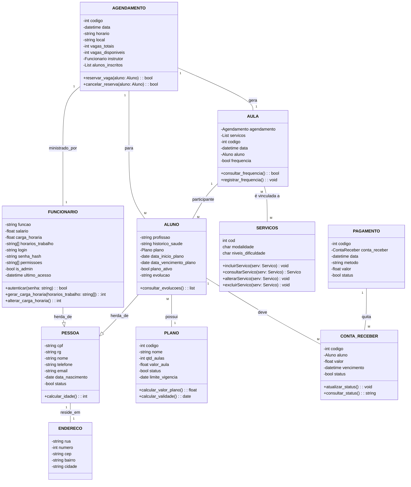

# Contagem de Pontos de Função

A contagem em **Pontos de Função (PF)** permite a determinação do **Tamanho Funcional** do projeto de software.
A análise de ponto de função (APF) é um processo para a identificação e contagem das funcionalidades baseadas nos conceitos 
de **Funções de Dados** e **Funções de Transação**. 

Os conceitos relacionados com dados são os **Arquivos de Lógica Interna (ALI)** e os **Arquivos de Interface Externa (AIE)**, 
e os conceitos relacionados com operações externas a fronteira do sistema são: 
**Entrada Externa (EE)**, **Consulta Externa (CE)** e **Saída Externa (SE)**.

Existem várias práticas de contagem, cada uma com suas especificidades.

## Contagem Indicativa

Na contagem indicativa (Ci) só é necessário conhecer e analisar as **Funções de Dados**. Desta forma, 
os **ALI**s (Arquivos Lógicos Internos) com o valor de *35 PF* cada e os **AIE**s (Arquivos de Interface Externa) com o valor de *15 PF* cada.

### Modelo de Dados 

### Contagem Indicativa

| Função de Dado  | Entidades Relacionadas | Tamanho em PF |
| --------------- | ---------------------- | :-----------: |
| ALI Endereço     | Endereço        | 35 PF         |
| ALI Pessoa     | Pessoa, Funcionario, Aluno               | 35 PF         |
| ALI Plano | Plano          | 35 PF         |
| ALI Agendamento    | Agendamento              | 35 PF         |
| ALI Aula    | Aula              | 35 PF         |
| ALI Conta Receber    | Conta_receber              | 35 PF         |
| ALI Pagamento    | Pagamento              | 35 PF         |
| ALI Serviço    | Servicos              | 35 PF         |
| **Total**       | **Ci**                 | **280 PF**    |

### Contagem Detalhada (Cd)

|     Descrição      |   Tipo   |   RLR   |   DER   |   Complexidade   |   Tamanho em PF   |
| ------------------ | -------- | ------- | ------- | ---------------- | :---------------: |
|  ALI Endereço       |   ALI    |    1    |    5   |       Baixa      | 7 PF              |
|  ALI Pessoa       |   ALI    |    2    |    7   |       Média      | 10 PF              |
|  ALI Plano       |   ALI    |    1    |    6   |       Baixa      | 7 PF              |
|  ALI Agendamento       |   ALI    |    1    |    6   |       Baixa      | 7 PF              |
|  ALI Aula       |   ALI    |    1    |    5   |       Baixa      | 7 PF              |
|  ALI Conta Receber       |   ALI    |    1    |    4   |       Baixa      | 7 PF              |
|  ALI Pagamento       |   ALI    |    1    |    4   |       Baixa      | 7 PF              |
|  ALI Serviço       |   ALI    |    1    |    4   |       Baixa      | 7 PF              |
|  **Descrição**     | **Tipo** | **ALR** | **DER** | **Complexidade** | **Tamanho em PF** |
|  RF01 - Cadastrar Aluno     |    EE    |    2    |    6    |      Média       | 4 PF              |
|  RF02 - Pesquisar Aluno   |    CE    |    2    |    6    |      Média       | 4 PF              |
|  RF03 - Alterar Aluno   |    EE    |    2    |    6    |      Média       | 4 PF              |
|  RF04 - Excluir Aluno   |    EE    |    1    |    2    |      Baixa       | 3 PF              |
|  RF01 - Cadastrar Funcionário     |    EE    |    2    |    6    |      Média       | 4 PF              |
|  RF02 - Pesquisar Funcionário   |    CE    |    2    |    6    |      Média       | 4 PF              |
|  RF03 - Alterar Funcionário   |    EE    |    2    |    6    |      Média       | 4 PF              |
|  RF04 - Excluir Funcionário   |    EE    |    1    |    2    |      Baixa       | 3 PF              |
|  RF01 - Cadastrar Serviço     |    EE    |    1    |    4    |      Baixa       | 3 PF              |
|  RF02 - Pesquisar Serviço   |    CE    |    1    |    4    |      Baixa       | 3 PF              |
|  RF03 - Alterar Serviço   |    EE    |    1    |    4    |      Baixa       | 3 PF              |
|  RF04 - Excluir Serviço   |    EE    |    1    |    2    |      Baixa       | 3 PF              |
|  RF01 - Registrar Aula     |    EE    |    2    |    5    |      Média       | 4 PF              |
|  RF02 - Pesquisar Aula   |    CE    |    2    |    5    |      Média       | 4 PF              |
|  RF03 - Alterar Aula   |    EE    |    2    |    5    |      Média       | 4 PF              |
|  RF01 - Cadastrar Agendamento     |    EE    |    2    |    5    |      Média       | 4 PF              |
|  RF02 - Pesquisar Agendamento   |    CE    |    2    |    5    |      Média       | 4 PF              |
|  RF03 - Alterar Agendamento   |    EE    |    2    |    5    |      Média       | 4 PF              |
|  RF04 - Cancelar Agendamento   |    EE    |    2    |    3   |      Baixa       | 3 PF              |
|  RF01 - Cadastrar Plano     |    EE    |    1    |    4    |      Baixa       | 3 PF              |
|  RF02 - Pesquisar Plano   |    CE    |    1    |    4    |      Baixa       | 3 PF              |
|  RF03 - Alterar Plano   |    EE    |    1    |    4    |      Baixa       | 3 PF              |
|  RF04 - Excluir Plano   |    EE    |    1    |    2    |      Baixa       | 3 PF              |

|   **Total**        |          |         |         |     **Cd**       | **138 PF**         |

